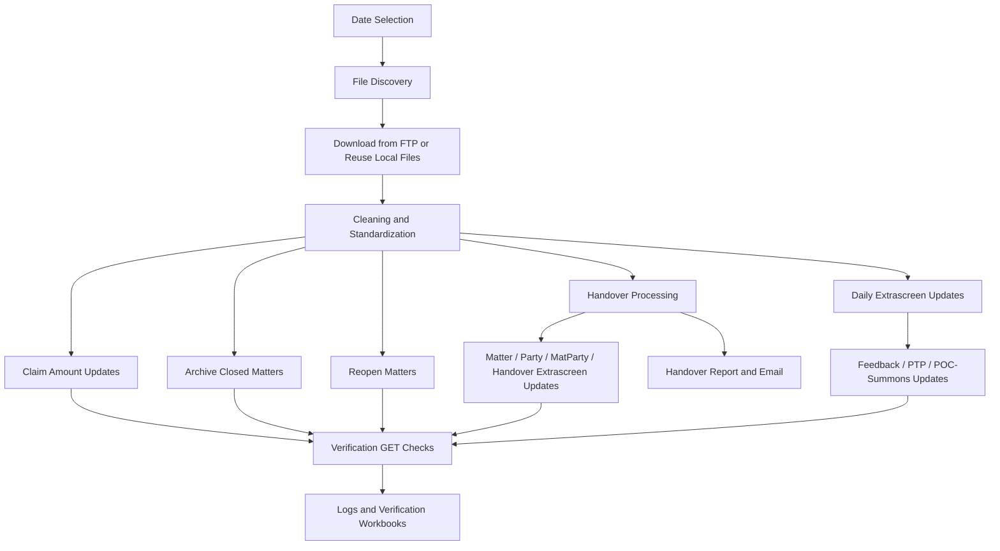

# Automation Flow Mapping

## Purpose

This document describes the automation at a business-process level rather than at code level.
The goal is to explain what the daily process does, what information flows through it, and what decisions are made at each stage.

The main orchestrator is `ftp_download_today.py`.

## High-Level Objective

The automation supports the daily operational movement of collection and litigation data between:

- Standard Bank source files delivered over FTP
- local working folders used for staging and cleaning
- LegalSuite for matter and extrascreen maintenance
- audit outputs such as logs, verification workbooks, and handover reports
- email distribution for newly created handover matters

At a high level, the automation is designed to:

- retrieve the expected files for a selected business date
- normalize those files into a consistent working format
- apply business updates into LegalSuite
- verify that the updates actually persisted
- produce operational evidence of what was processed

## Architecture Overview

At an architectural level, the solution is organized as a staged integration pipeline.

### Primary Components

- `ftp_download_today.py`
  - the main orchestration entrypoint
  - controls date resolution, file download, cleaning, LegalSuite updates, verification, and reporting
- FTP source
  - provides the daily operational files by business date and business stream
- local staging folders
  - `downloads/` stores raw or reused source files
  - `cleaned/` stores normalized working files
  - `verification/` stores row-level verification workbooks
- LegalSuite API
  - target system for matter, extrascreen, archive, reopen, party, and MatParty updates
- report and communication layer
  - creates text logs, handover Excel reports, email notifications, and FTP drop-offs for the handover report

### Architectural Pattern

The automation follows a repeated pattern:

1. acquire source data
2. normalize source data
3. map source fields to target payload fields
4. execute LegalSuite update
5. execute LegalSuite verification GET
6. write operational and audit outputs

This makes the solution:

- file-driven
- API-integrated
- verification-first
- auditable

### Main Processing Layers

- ingestion layer
  - FTP discovery and local file reuse
- transformation layer
  - cleaning, CSV-to-XLSX conversion, header normalization, value normalization
- business-rule layer
  - handover logic, extrascreen mapping, claim amount updates, archive rules, reopen rules
- integration layer
  - LegalSuite API requests with retries and fallback handling
- verification and reporting layer
  - GET-after-update verification, logs, verification workbooks, handover report email, and handover report FTP upload

## Field Mapping Overview

The automation uses mapping rules rather than hard-coded row positions wherever practical.

### Core Mapping Principle

Each process reads a source row, identifies key columns, and converts them into a LegalSuite payload.
The most important identifiers are:

- `FileRef`
- `Client Code`
- `Reference`
- `Desktop Extra ScreenID`
- process-specific amount or date fields

### Handover Matter Mapping

For handover files, the row is mapped into matter creation and update payloads.

Examples of direct mappings include:

- `Reference` -> `theirref`
- `Claim Amount` -> `claimamount`
- `Interest Rate` -> `interestrate`
- `EmployerID` -> `employerid`
- `TracingAgentID` -> `tracingagentid`
- `SheriffAreaID` -> `sheriffareaid`
- `SheriffID` -> `sheriffid`
- `BranchID` -> `branchid`
- `EmployeeID` -> `employeeid`
- `StageGroupID` -> `stagegroupid`
- `MatterTypeID` -> `mattertypeid`
- `DebtorFeeSheetID` -> `debtorfeesheetid`
- `ClientFeeSheetID` -> `clientfeesheetid`
- `DefendantEmail` -> `defendantemail`
- `MagCourtDistrict` -> `magcourtdistrict`
- `MagCourtHeldAt` -> `magcourtheldat`
- `ExtraScreenID` -> `extrascreenid`
- `In Duplum Amount` -> `induplumamount`
- `Maximum Interest Amount` -> `maximuminterestamount`
- `Alternate Reference` -> `alternateref`

The handover flow also derives values such as:

- next LegalSuite file reference
- matter description
- matter balances copied from claim amount
- internal comment and update timestamps

### Handover Party Mapping

The debtor party payload is built from handover debtor columns.

Examples include:

- `Debtor Surname` + `Debtor First Name` -> `party[name]`
- `Debtor Title` -> `party[parlang][salutation]`
- `ID Number` -> `party[identitynumber]`
- physical address lines -> party physical address fields
- postal address lines -> party postal address fields
- home, work, and cell numbers -> party phone fields
- `DefendantEmail` -> party email field

### Daily Extrascreen Mapping

The daily extrascreen process maps cleaned Excel columns into LegalSuite extrascreen fields.

At an abstract level:

- source column headers are matched against predefined mapping tables
- mapped values are written to `field1 ... fieldN`
- source date fields are encoded into LegalSuite date integers before submission

The current mapping sets cover:

- feedback extrascreens
- PTP extrascreens
- POC and summons extrascreens

### Handover Desktop Extra Screen Mapping

Handover files can also contain Desktop Extra Screen segments.

The automation checks:

- `DesktopExtraScreenID1`
- `DesktopExtraScreenID2`
- `DesktopExtraScreenID3`

If a screen ID is present and the row contains field values for that screen, the script maps the adjacent `Desktop Extra Field ...` values into the corresponding LegalSuite extrascreen payload.

### Claim Amount Mapping

The claim amount flow is intentionally narrow.

Its key mapping is:

- source `FileRef` -> target matter lookup
- source `Claim Amount` -> target `claimamount`

The script may include additional matter fields in the update payload for compatibility with LegalSuite update behavior, but the business intent is still a single-field amount update.

### Archive and Reopen Mapping

Archive and reopen flows use:

- source `FileRef` -> matter lookup

The update payload is then built mainly from the current LegalSuite matter state plus the status fields needed for:

- Archived
- Pending Deletion fallback
- Reopen

## End-to-End Flow

The daily run can be understood as eight logical stages.

## Flow Diagram

### Word-Friendly Diagram

```text
Date Selection
  ->
File Discovery
  ->
Download or Reuse Local Files
  ->
Cleaning and Standardization
  ->
Run Enabled Processing Branches
  |- Handover Processing
  |    -> Matter / Party / MatParty / Handover Extrascreen Updates
  |    -> Handover Report and Email
  |
  |- Extrascreen Updates
  |    -> Feedback / PTP / POC-Summons Screens
  |
  |- Claim Amount Updates
  |
  |- Archive Closed Matters
  |
  |- Reopen Matters
  ->
Verification GET Checks After Each Update
  ->
Logs and Verification Workbooks
```

### Markdown Diagram



### Standalone Diagram File

A standalone diagram is also available in:

- `AUTOMATION_FLOW_DIAGRAM.svg`

### 1. Date Resolution

The automation first resolves the business date to process.
This may be:

- today
- a backdated value supplied with `--date YYYYMMDD`
- a relative day supplied with `--days-ago`

This date is then used to derive:

- expected FTP filenames
- expected month folders
- output log names
- handover report names

### 2. File Discovery and Download

The script then determines which source files are expected for that date.

The source groups include:

- Debt Review close files
- Debt Review PTP files
- Debt Review feedback files
- Debt Review reopen files
- Debt Review handover files
- Panel L PTP files
- Panel L feedback files
- Panel L handover files
- Panel L closed files
- Panel L reopen files
- claim amount files
- POC and summons files

For each expected source:

- if FTP mode is active, the script connects to FTP and tries to download the newest matching file
- if `--clean-only` is used, the script skips FTP and reuses already downloaded local files

Possible outcomes at this stage:

- file downloaded successfully
- existing local file reused
- expected file missing
- expected directory missing

### 3. Cleaning and Standardization

Downloaded files are not used directly for downstream processing.
They are first cleaned into a normalized working area.

The cleaning stage does things such as:

- convert CSV input into XLSX where needed
- preserve source folder structure under `cleaned/`
- strip non-digit characters from fields such as account numbers
- clear fields that must not flow into downstream updates
- preserve handover headers so the handover parser can read them correctly
- align handover reference and account number behavior before LegalSuite processing

This stage creates a consistent working dataset for all later operations.

### 4. Handover Processing

If handover processing is enabled, the script processes handover files before the other daily update stages.

At an abstract level, the handover flow does the following:

1. locate handover files for the selected date
2. read debtor and matter source data row by row
3. map the source client code to the target LegalSuite client
4. determine the next LegalSuite file reference for that client
5. create a new matter when appropriate
6. update selected matter fields after creation
7. create or reuse the debtor party
8. create or reuse the MatParty link between the matter and party
9. update Desktop Extra Screen data for the new or matched matter when handover extrascreen values exist

The handover flow also generates an operational report of newly created matters.

That report includes:

- Matter File Reference
- Their Reference
- Matter Description

The report is then emailed to either:

- the live business recipients, or
- the test recipients when test email mode is enabled

After a successful email send, the same report is uploaded to FTP into:

- `Matter Ref Updates`

### 5. Daily Extrascreen Updates

If extrascreen updating is enabled, the script processes cleaned:

- feedback files
- PTP files
- POC and summons files

At a business-flow level, each record goes through this pattern:

1. read the row
2. identify the target matter using FileRef
3. identify the target Desktop Extra Screen using the screen ID column
4. map the row columns into LegalSuite `field1 ... fieldN`
5. encode date-type fields where LegalSuite expects date integers
6. send the extrascreen update
7. fetch the extrascreen back
8. compare returned values with the intended payload

Important rule:

- if a row has no usable extrascreen ID or no actual extrascreen data, it is skipped rather than updated

### 6. Claim Amount Updates

If claim amount updating is enabled, the script processes the claim amount file for the selected date.

At an abstract level:

1. find the file
2. read FileRef and Claim Amount
3. fetch the current LegalSuite matter by FileRef
4. submit a matter update carrying the claim amount
5. fetch the matter again
6. compare the returned claim amount against the intended value

The claim amount flow includes targeted fallback behavior for known LegalSuite edge cases, while still treating verification as the source of truth.

### 7. Closed Matter Archiving

If archive processing is enabled, the script reads the cleaned closed files and attempts to archive the matching LegalSuite matters.

At a business-flow level:

1. gather FileRef values from closed files
2. fetch each target matter from LegalSuite
3. submit an archive update
4. fetch the matter again
5. verify the returned archive state

If LegalSuite refuses the archive because the matter cannot yet be archived, the automation falls back to:

- Pending Deletion

If LegalSuite accepts the call but still returns the matter as Live, the automation also falls back to:

- Pending Deletion

### 8. Reopen Processing

If reopen processing is enabled, the script reads reopen files and attempts to move archived matters back into an active state.

At a business-flow level:

1. gather FileRef values from reopen files
2. fetch each target matter
3. submit a reopen update
4. fetch the matter again
5. verify the archive-related fields now reflect a reopened state

## Core Data Mapping Concept

The automation repeatedly applies the same pattern:

- source file row
- mapped target payload
- LegalSuite update
- LegalSuite get/verification

This pattern is used in:

- handover matter updates
- handover extrascreen updates
- daily extrascreen updates
- claim amount updates
- archive updates
- reopen updates

So the automation is not just a sender of data.
It is a send-and-confirm workflow.

## Verification Model

Verification is a core design principle of the automation.

After each important LegalSuite update, the script performs a GET call and compares:

- what was intended
- what LegalSuite actually returns afterwards

Possible verification outcomes include:

- verified
- mismatch
- failed
- skipped
- fallback verified

The automation also writes verification workbooks so there is an auditable row-level record of:

- the processed source row
- the verification status
- notes about mismatches or failures
- selected returned values from LegalSuite

## Main Outputs

The automation produces four main output categories.

### Operational Data Outputs

- updated LegalSuite matters
- updated LegalSuite extrascreens
- archived matters
- reopened matters

### Staging Outputs

- downloaded source files in `downloads/`
- cleaned working files in `cleaned/`

### Audit Outputs

- report log files
- verification workbooks in `verification/`

### Communication Outputs

- handover Excel report
- handover report email with attachment
- handover report FTP upload to `Matter Ref Updates`

## Control Modes

The automation supports different operating modes depending on what needs to be done.

Examples:

- full daily run
- backdated rerun
- clean-only rerun from existing files
- handover dry-run
- extrascreen-only processing
- claim-amount-only processing
- archive-only processing
- reopen-only processing
- handover email test mode

This makes the solution useful both for production execution and for controlled troubleshooting.

## Exception and Fallback Philosophy

The automation is built to continue operating sensibly when real-world source data or LegalSuite responses are imperfect.

Examples of handled conditions include:

- missing FTP files
- missing FTP directories
- rows with incomplete keys
- extrascreen rows with no actual update data
- archive attempts that must fall back to Pending Deletion
- intermittent LegalSuite connectivity issues with retry handling
- update calls that appear to succeed but do not persist on verification

The design principle is:

- do the safe action possible
- verify the result
- record the outcome for audit and support follow-up

## Abstract System View

The automation can be summarized as this flow:

1. Select date
2. Locate source files
3. Download or reuse files
4. Clean and normalize files
5. Run enabled business processes
6. Verify every important LegalSuite change
7. Record logs and verification evidence
8. Send handover report email when relevant
9. Upload the handover report to FTP when the email send succeeds

## Recommended Use of This Document

This document is intended for:

- business stakeholders who need a process overview
- support staff who need to understand the operational sequence
- developers who need a map before reading the implementation
- audit and handover documentation where a high-level explanation is needed

For implementation detail, command usage, and environment setup, refer to `README.md`.
